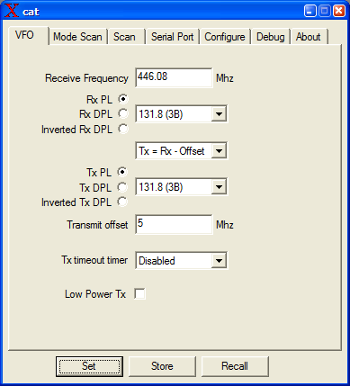
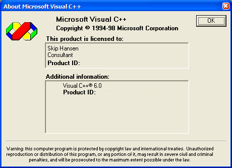
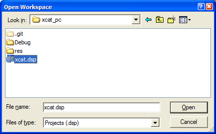
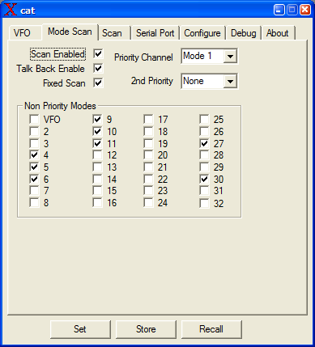
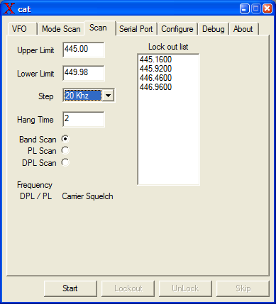
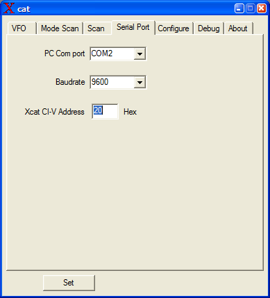
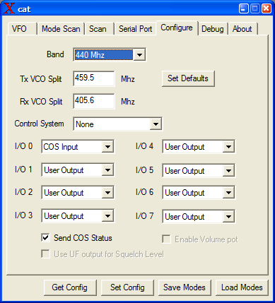
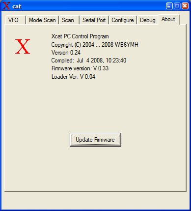

# Xcat PC control program

https://github.com/skiphansen/xcat_pc

## What is this?

This is a Windows program to control the Xcat Syntor X code plug replacement 
project via a serial port.

This program was originally written in 2004 and hasn't been touched since 
Jan 2009. 

I've put this on github as a history preservation project.

For more information about Xcats visit the Xcat group on [groups.io](https://groups.io/g/xcat)

The Sytnor X was OLD in 2004 when this project was started and 18 years later
they are STILL working! In fact I'm listening to 445.42 on my Syntor X base as 
I write this file.

I **WISH** PCs lasted a bit longer, NONE of my PCs from 2004 still work.

## Building

1. Install Visual C++ 6.0 (1998).  

Newer versions may be able to convert the project, I don't know.  I haven't done 
any Windows programming for years.

2. Clone this repository.

3. Change directory into xcat_pc.

4. Open xcat.dsp.

5. Select "Rebuild All" from the Build menu

## Screen shots

## Mode scan configuration screen

## Frequency scan screen

## Serial port configuration screen

## Configuration screen

## About screen

